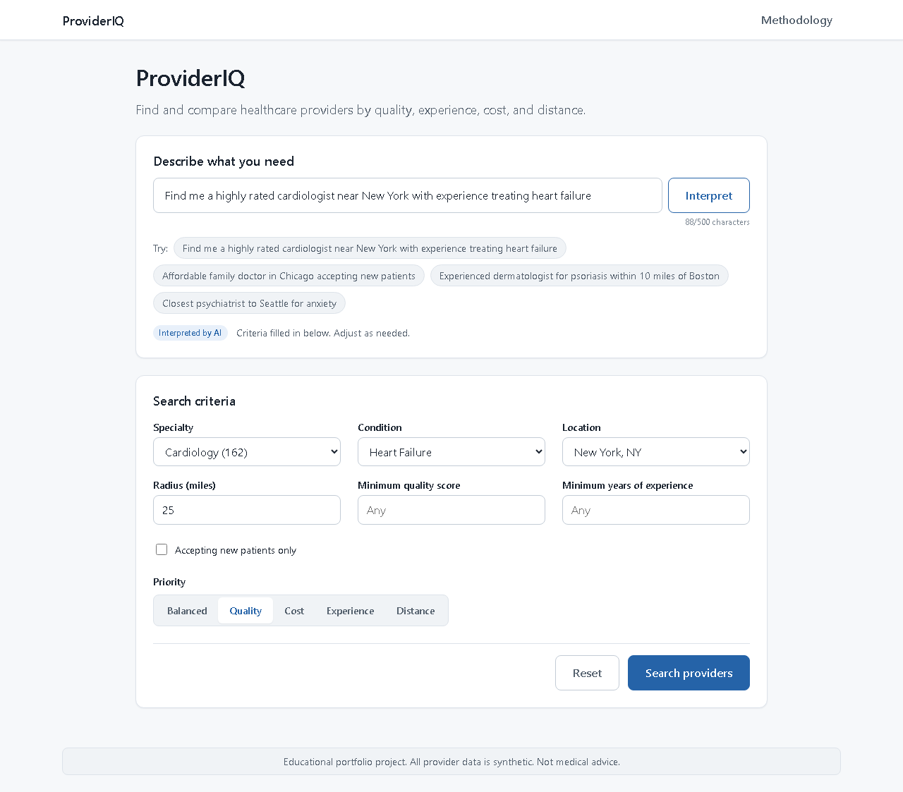
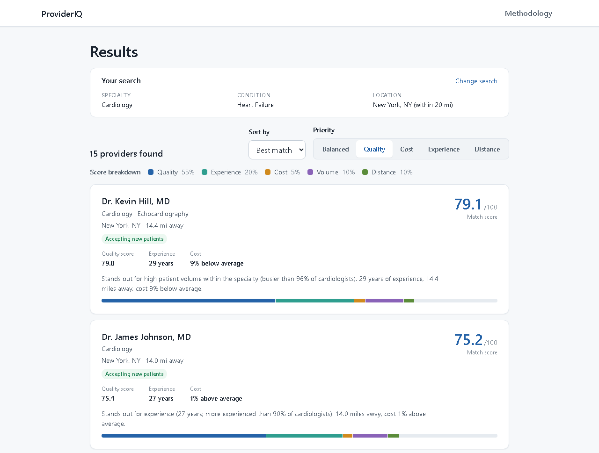
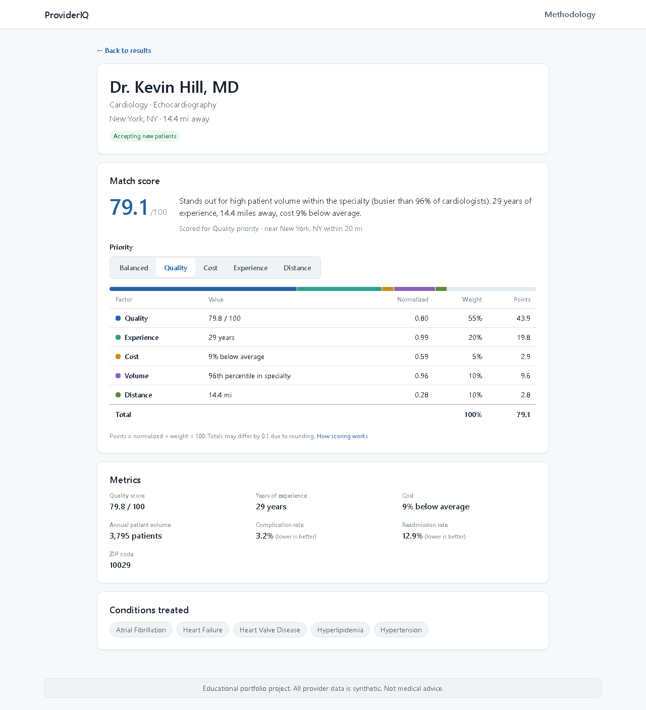
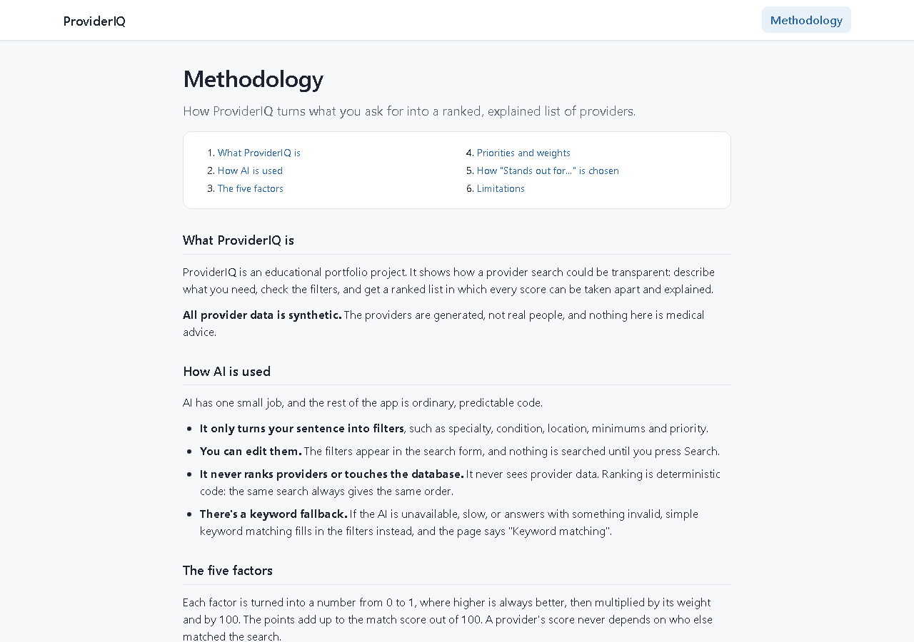
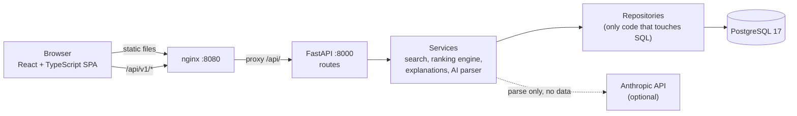
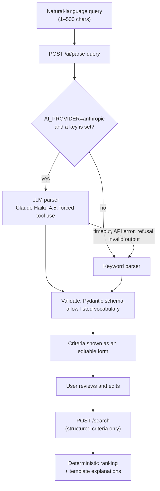
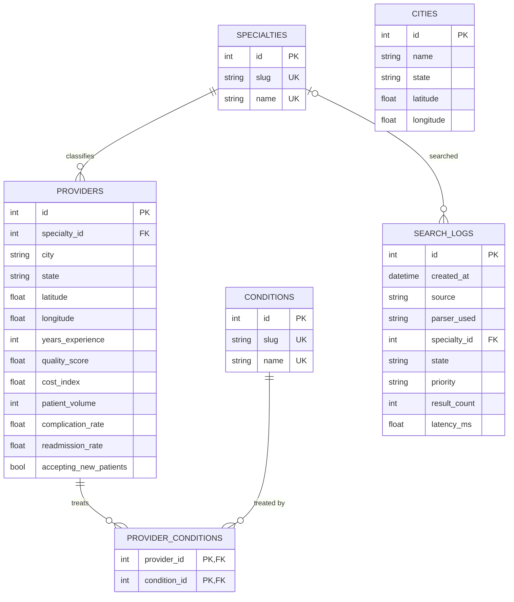

# ProviderIQ

Describe the doctor you need in plain English, then get a ranked list where every score can
be taken apart and explained.

> **Educational portfolio project. All provider data is synthetic: the providers are
> generated, not real people. This is not a medical recommendation system and does not
> provide medical advice.**

## Screenshots

| Search: the AI fills in editable filters | Results: ranked, with score bars and explanations |
|---|---|
|  |  |
| **Provider detail: the full score breakdown** | **Methodology: how it all works** |
|  |  |

Captured from the running Docker stack with `npm run screenshots` (Playwright).

## Overview

**The problem.** Provider directories make you translate what you need into their filters,
then rank results by criteria they don't show. "Best match" is a black box.

**The core idea.** Split the job so each part does what it is good at:

1. **An LLM parses intent, and only that.** "A highly rated cardiologist near New York for
   heart failure" becomes structured filters. The user sees them as an editable form and
   fixes anything the AI got wrong before searching.
2. **A deterministic engine ranks.** Plain Python scores five factors with published
   weights. The same search always gives the same order, and the LLM never sees provider
   data.
3. **Every score is explainable.** Each result shows how many points each factor earned,
   and a sentence says what makes this provider stand out among their specialty peers.

## Features

- **Natural-language search** with Claude Haiku 4.5 and an automatic keyword fallback. The
  app runs fully without an API key.
- **Editable criteria**: specialty, condition, location and radius, minimum quality,
  minimum experience, accepting new patients, and a priority (balanced, quality, cost,
  experience, distance).
- **Ranked results** with a stacked score bar per provider, sorting, and pagination.
- **Provider detail page** with the score breakdown table (value, normalized, weight,
  points), a priority switcher, metrics, outcome rates, and conditions treated.
- **Peer-based explanations**, e.g. "Stands out for high patient volume within the specialty
  (busier than 96% of cardiologists)."
- **Methodology page** that renders the live weight profiles from the API.
- **Shareable URLs**: all search state lives in the query string.
- **Synthetic dataset**: 1,500 providers, 10 specialties, 50 conditions, and 25 cities,
  generated from a fixed seed.
- **Real public data, optionally**: about 9,000 New Jersey physicians from three CMS
  datasets, built by a SQL ELT pipeline with a [data-quality report](docs/data-quality.md).
  Missing quality and experience are scored as the specialty median and flagged, never
  shown as standouts.

## Architecture

**Request flow.** The browser only ever talks to one origin. nginx serves the built app and
proxies `/api/` to FastAPI, so there is no CORS in the deployed setup.

**From a sentence to a ranked list.** Parsing and searching are two separate calls. `/search`
never sees free text and never calls the LLM.

The backend layers are strict (routes → services → repositories), and an architecture test
fails the build if the ranking engine imports the database or web framework, or if the AI
package imports repositories, models, or the database. More in
[docs/architecture.md](docs/architecture.md).

## Tech stack

| Layer | Choices |
|---|---|
| Backend | Python 3.12, FastAPI, SQLAlchemy 2 (sync), Alembic, Pydantic v2 + pydantic-settings, psycopg 3, uvicorn |
| AI | Anthropic Python SDK, Claude Haiku 4.5 (`claude-haiku-4-5-20251001`), rule-based fallback parser |
| Database | PostgreSQL 17 |
| Frontend | React 19, TypeScript (strict), Vite, React Router, CSS Modules with design tokens, plain `fetch` |
| Testing | pytest, Hypothesis, Vitest, React Testing Library, Playwright (screenshots) |
| Quality | ruff (lint + format), ESLint, Prettier, `tsc --noEmit` |
| Infrastructure | Docker Compose, nginx (unprivileged), GitHub Actions, Dependabot |

## How AI is used

The LLM has exactly one job: turn a sentence into the same criteria the search form
produces. Everything after that is ordinary, testable code.

- **Parse only.** `/ai/parse-query` returns criteria and never searches. The LLM never ranks,
  never sees provider data, and has no database access.
- **Forced tool use.** The request defines one tool whose input schema is the criteria
  schema, and `tool_choice` forces it. The reply is always a typed object; no free text is
  parsed. The tool is never executed.
- **Allow-listed vocabulary.** Every specialty, condition, and city in the output is checked
  against the values loaded from the database. Unknown values are dropped with a warning
  that doesn't repeat them.
- **Pydantic validation.** The output must validate against a closed schema
  (`extra="forbid"`, enums, bounded ranges). A radius or distance priority without a
  location is dropped, because `/search` would reject it.
- **Keyword fallback.** Any failure (timeout, API error, refusal, truncated or malformed
  output, an extra field) falls back to the keyword parser. The response still succeeds,
  labelled `parser_used: "rule_based"`, and the UI shows "Keyword matching" instead of
  "Interpreted by AI".
- **Injection containment.** The query is escaped and wrapped in `<query>` tags, and the
  system prompt treats it as data. More importantly, there is nothing to steal: no data
  access, no executable tools, nothing secret in the prompt. The worst a successful
  injection can do is produce a different valid search, which the user then sees.
- **Query text is never logged.** Parse logs record only the parser used, latency, query
  length, and warning count. LLM failures log only the exception type. `search_logs` stores
  no text, condition, or city.
- **Cost controls.** Haiku 4.5, temperature 0, a 512-token output cap, an 8-second timeout
  with no retries, a 500-character input limit, and a separate per-IP limit of 10 parses a
  minute. Tests use a fake client; the one real-API test only runs with `pytest -m live`.

### Parser accuracy

`python -m scripts.eval_parser` scores both parsers field by field on 22 labeled queries.
Latest run:

| Field | Keyword parser | LLM (Claude Haiku 4.5) |
|---|---|---|
| specialty | 20/22 (91%) | 21/22 (95%) |
| condition | 22/22 (100%) | 21/22 (95%) |
| location | 21/22 (95%) | 22/22 (100%) |
| radius_miles | 22/22 (100%) | 22/22 (100%) |
| min_quality_score | 22/22 (100%) | 22/22 (100%) |
| min_years_experience | 22/22 (100%) | 22/22 (100%) |
| accepting_new_patients | 22/22 (100%) | 22/22 (100%) |
| priority | 20/22 (91%) | 22/22 (100%) |
| **Queries fully correct** | **18/22** | **20/22** |

The keyword parser misses slang and paraphrase: "the Big Apple", "won't break the bank",
"GI doc", "shrink", "as close as possible".

The LLM's two misses:

- *"lung cancer specialist in Miami"*: it added the specialty oncology. The label leaves
  the specialty open because both oncologists and pulmonologists treat lung cancer (the
  directory has 58 and 67 of them). Guessing oncology quietly drops the pulmonologists.
- *"my doctor says I should see a heart specialist in Atlanta about chest pain"*: it
  **inferred the condition coronary artery disease from the symptom "chest pain"**. This is
  the risky direction in healthcare: a symptom is not a diagnosis, and filtering on it
  narrows the results to specialists in one condition. The mitigation today is the design:
  the parsed condition appears in the editable form, and nothing is searched until the user
  confirms. The prompt fix is the first item under [future improvements](#future-improvements).

## Ranking methodology

Each factor is normalized to [0, 1], where higher is always better, then weighted:

| Factor | Normalization |
|---|---|
| Quality | `quality_score / 100` |
| Experience | `min(1, ln(1 + years) / ln(31))`: diminishing returns, capped at 30 years |
| Cost | `clamp(1.5 − cost_index, 0, 1)`: average cost (1.0) scores 0.5 |
| Volume | percentile of annual patients **within the specialty** |
| Distance | `1 − distance / radius` (dropped when there's no location, and the rest renormalized) |

The priority picks a weight profile. Every profile sums to 1, and **quality is never
weighted below 0.25**, so a cheap or nearby provider can't reach the top on that alone.

| Priority | Quality | Experience | Cost | Volume | Distance |
|---|---|---|---|---|---|
| balanced | .35 | .20 | .15 | .15 | .15 |
| quality | .55 | .20 | .05 | .10 | .10 |
| cost | .25 | .10 | .45 | .05 | .15 |
| experience | .25 | .45 | .10 | .10 | .10 |
| distance | .25 | .10 | .10 | .05 | .50 |

The overall score is `Σ 100 × weight × normalized`, so each factor's points add up exactly
to the total. Scores are **pool-independent**: normalization uses fixed bounds or
specialty-wide percentiles, never the min and max of the current results. Ties break by
overall score, then quality, then provider id, so pagination is stable.

Explanations name the factor where a provider ranks highest **among their specialty peers**,
if they beat at least 80% of them. These peer percentiles only shape the wording, and a test
inverts them and checks that every score and position stays the same.

Full details, a worked example, and the reasoning: [docs/ranking.md](docs/ranking.md).

## Database schema

`cities` is the local geocoding table that user locations resolve against, so there is no
external geocoding API. `CHECK` constraints enforce the value ranges (quality 0–100, rates
0–1, and so on) in the database as well as in Pydantic.

| Index | Why |
|---|---|
| `providers(specialty_id, state)` | Almost every search filters by specialty; the leading column also covers the foreign key |
| `providers(latitude, longitude)` | The radius search's bounding-box prefilter |
| `provider_conditions(condition_id)` | The primary key starts with `provider_id`; "who treats X" needs the reverse direction |
| `search_logs(created_at)` | Time-range queries for observability |

There is deliberately no `quality_score` index: a minimum-quality filter matches most rows.
`EXPLAIN` on the seeded data shows a specialty + bounding-box search combining both provider
indexes with a `BitmapAnd`.

## API

All endpoints are under `/api/v1`. Full reference with real examples: [docs/api.md](docs/api.md).
OpenAPI docs: http://localhost:8000/docs.

| Method | Path | Purpose |
|---|---|---|
| GET | `/health` | App and database status (503 when the database is down) |
| GET | `/specialties` | Specialties with provider counts |
| GET | `/conditions?specialty=` | Conditions, optionally only those treated in a specialty |
| GET | `/cities` | Locations a search can use |
| GET | `/dataset` | Which dataset is loaded (synthetic or CMS New Jersey), what it publishes, and its disclaimer |
| GET | `/providers` | Browse without ranking (filters + pagination) |
| GET | `/providers/{id}` | Detail; with `priority` (and a location) it adds the same score and explanation a search would give |
| POST | `/search` | Ranked search with structured criteria |
| GET | `/ranking/weights` | The weight profiles, served from the engine's own config |
| POST | `/ai/parse-query` | Natural language → criteria (never searches) |

Every error has the shape `{"error": {"code", "message", "request_id", "details?"}}`, with
codes such as `VALIDATION_ERROR`, `INVALID_SEARCH`, `LOCATION_NOT_FOUND`,
`CONDITIONS_UNAVAILABLE`, `RATE_LIMITED`, and `INTERNAL_ERROR`. Submitted values are never echoed back, and no stack traces leak.

## Security

- **Secrets.** `.env` is git-ignored, excluded from every Docker build context, and passed to
  containers at runtime. The API key is a `SecretStr`, so it never appears in logs or reprs.
- **Input validation.** Closed Pydantic schemas (`extra="forbid"`) with bounded ranges on every
  request body; database `CHECK` constraints behind them. All SQL goes through SQLAlchemy
  with bound parameters. The frontend parses URL state strictly and drops anything invalid.
- **Abuse limits.** A 64 KiB request body limit (413), a sliding-window per-IP rate limit of
  120 requests a minute, and 10 a minute on the AI endpoint (429 with `Retry-After`).
- **Client IPs can't be spoofed.** uvicorn trusts `X-Forwarded-For` only from
  `FORWARDED_ALLOW_IPS`, so a client can't dodge the per-IP limits with a forged header.
- **CORS** is an allow-list: `GET` and `POST` only, no credentials. The deployed shape is
  same-origin anyway.
- **Security headers** from nginx: a strict Content-Security-Policy (same-origin resources
  only, no inline scripts), `X-Frame-Options: DENY`, `X-Content-Type-Options: nosniff`, and a
  `Referrer-Policy`.
- **Containers.** Both run as non-root users. The backend image has runtime dependencies only,
  and its code is read-only to the app user.
- **Privacy.** No query text, condition, or city is ever logged or stored.
- **Safe operations.** Reseeding (which deletes provider data) is refused when
  `ENVIRONMENT=prod`. Dependabot proposes weekly dependency updates.
- **LLM containment**: see [How AI is used](#how-ai-is-used).

## Testing

| Suite | Tests | Runtime |
|---|---|---|
| Backend (pytest) | **388** passing: 265 unit, 123 integration against a real Postgres test database | ~24 s |
| Frontend (Vitest + React Testing Library) | **186** passing across 13 files | ~28 s |

Two live tests that call the real Anthropic API are excluded by default and run only with
`pytest -m live`.

What's covered beyond the usual endpoint and component tests:

- **Property-based tests** (Hypothesis) on the ranking engine: the overall score stays in
  [0, 100], contributions sum to the overall, improving any single factor never lowers the
  score, and ranking is sorted and independent of input order.
- **Architecture tests** that parse imports (and check indirect imports in a subprocess) so
  the ranking engine stays pure and the AI package can't reach the data layer.
- **N+1 guards**: search runs a constant number of queries regardless of result size, and
  the provider list doesn't issue a query per row.
- **A race-condition test**: on the results page, a slow, stale response can never replace
  a newer one.
- **Invariance tests**: the volume percentile doesn't change with the search filters,
  inverting the explanation-only peer percentiles changes no score or position, and a
  provider's detail page returns exactly its search score and explanation.
- **AI safety tests**: injection attempts yield only valid criteria, and the query text never
  reaches the logs.

**CI** (GitHub Actions, on every push to `main` and every pull request):

- **Backend**: ruff lint and format check, then pytest against a Postgres 17 service
  container, with `AI_PROVIDER=none`.
- **Frontend**: typecheck, lint, format check, tests, and build.
- **Docker**: builds and starts the whole Compose stack, waits for it to be healthy, and
  runs the smoke test against it.

## Running it

### Docker (recommended)

Needs Docker with Compose v2. From the repo root:

    cp .env.example .env        # then set POSTGRES_PASSWORD (URL-safe: no @ : / ? #)
    docker compose up --build

Open **http://localhost:8080**. The first start runs migrations and loads the synthetic
data; later starts keep the existing data. The app works without an API key, using the
keyword parser. To enable the AI parser, set `AI_PROVIDER=anthropic` and `ANTHROPIC_API_KEY`
in `.env`.

| Port | Service | Notes |
|---|---|---|
| 8080 | frontend (nginx) | The app; proxies `/api/` to the backend |
| 8000 | backend (FastAPI) | Direct API access; docs at http://localhost:8000/docs |
| 5433 | db (Postgres 17) | Host port for local tools and tests (`db:5432` inside Compose) |

Useful commands:

    python backend/scripts/smoke_test.py                  # end-to-end check (stdlib only)
    docker compose exec backend python -m scripts.seed_db # reseed from data/
    docker compose down -v                                # delete the database volume

### Local development (hot reload)

Start only the database, then run the backend and frontend natively. Stop the backend
container first, because it also uses port 8000. Docker and local development share the
same database volume, so data loaded by either is visible to both.

    docker compose up -d db

Backend, on http://localhost:8000:

    cd backend
    python -m venv .venv            # Python 3.12
    .venv\Scripts\Activate.ps1      # Windows; macOS/Linux: source .venv/bin/activate
    pip install -r requirements-dev.txt
    alembic upgrade head
    python -m scripts.seed_db --if-empty   # loads data/ only into an empty database
    uvicorn app.main:app --reload

Frontend, on http://localhost:5173 (Node 24, see `frontend/.nvmrc`). The dev server proxies
`/api` to the backend:

    cd frontend
    npm install
    npm run dev

Checks:

    # backend/
    ruff check .
    ruff format --check .
    pytest

    # frontend/
    npm run typecheck
    npm run lint
    npm run format:check
    npm test
    npm run build

    # frontend/, with the Docker stack running (makes one real AI parse)
    npx playwright install chromium   # once
    npm run screenshots

### Real data: CMS, New Jersey

The app ships with synthetic data. It can also run on real public CMS data for New Jersey
physicians (how it's built: [architecture.md, section 10](docs/architecture.md#10-real-data-cms-new-jersey);
what came out: [data-quality.md](docs/data-quality.md)). The processed files in `data/cms/`
are committed, so **seeding needs no network**:

    cd backend
    alembic upgrade head
    python -m scripts.seed_db --source cms_nj

Or set `DATA_SOURCE=cms_nj` in `.env` and run `python -m scripts.seed_db` (Docker's first
start does the same). Seeding replaces whatever dataset was loaded; `--source synthetic`
switches back. `GET /api/v1/dataset` reports which one is loaded.

To rebuild `data/cms/` from the sources (downloads about 80 MB into the gitignored
`data/raw/`, then transforms in the `staging` schema of `DATABASE_URL`):

    python -m pipeline.extract       # cached; --refresh downloads again
    python -m pipeline.transform     # load + SQL transforms + CSVs + docs/data-quality.md
    python -m scripts.seed_db --source cms_nj

Tests and CI always use synthetic data; the pipeline is tested on small fake files in
`backend/tests/fixtures/cms_raw/`.

## Design decisions and tradeoffs

**The LLM parses but never ranks.** Ranking by LLM would be non-deterministic, impossible to
explain faithfully, slow, and would require sending provider data to a third party. Parsing
is the part where language understanding actually helps, and its output can be validated
and shown to the user. The cost is that the AI can't weigh soft preferences it has no field
for.

**Pool-independent normalization.** Min-max scaling over the current results would make a
provider's score depend on who else matched: adding a filter could change it, and the detail
page couldn't reproduce the search score. Fixed bounds and specialty-wide percentiles make a
score a property of the provider and the priority. The tradeoff: scores don't stretch to
fill 0–100 within a result set, so the top result may score 79, not 100.

**Volume as a percentile within the specialty.** Primary care sees thousands of patients a
year and oncology hundreds, so raw counts can't be compared. The percentile is computed with
a SQL window function over the whole specialty, not the filtered results, for the same
pool-independence reason.

**Peer-percentile explanations, on the third try.**

1. *Largest contribution* ("Ranked mainly on quality") mostly restated the weights. On the
   seeded data with no location, quality had the largest contribution for 1,469 of 1,500
   providers under `balanced` and all 1,500 under `quality`.
2. *Highest normalized score* was skewed by curve shapes. The experience curve saturates
   early by design, so 57% of providers "stood out for experience".
3. *Highest peer percentile* ("busier than 96% of cardiologists") puts every factor on the
   same scale. It leads only when the provider beats 80% of peers, so "no single standout"
   is common and honest.

**Sync SQLAlchemy.** Every route is a plain `def`, which FastAPI runs in a threadpool. The
queries are short, the code is simpler, and there's no async/sync split to get wrong. At much
higher concurrency the threadpool becomes the limit, and async (or more workers) would be
the change.

**In-memory rate limiter, per process.** A sliding window in a dictionary needs no extra
infrastructure and is fully unit-testable with a fake clock. The known limitation: with
several workers or instances, each keeps its own count, so the effective limit multiplies.
Redis fixes that.

**Bounding-box prefilter + haversine instead of PostGIS.** A lat/lon box uses a plain B-tree
index to cut the candidates, then exact great-circle distance in Python drops the corners.
It runs on any Postgres, with no extension. PostGIS (GiST index, nearest-neighbour queries)
is the upgrade at scale.

**Ranking in Python.** The filtered candidates are scored in Python, not SQL. The entire
dataset is 1,500 providers, so the largest possible candidate set is small, and the engine
stays pure and property-testable. At millions of rows, scoring would move into the database
or a search engine.

**The URL is the single source of truth for search state.** Results survive refresh, links
can be shared, and the back button works. Because the URL is user input, parsing is strict:
anything malformed or out of range is dropped before reaching the API.

**Synthetic data with deliberate correlations.** Real provider-quality data isn't freely
available, and fake people avoid any privacy question. The generator (seeded, so
byte-identical output) builds in realistic structure:

- Quality tracks outcomes. Within a specialty, the average correlation of quality with
  complication rate is −0.81, and with readmission rate −0.79.
- Cost is drawn independently of quality (correlation −0.008). Cheaper isn't better or
  worse, so the cost priority is a real tradeoff and visibly reorders results.

## Deployment

**Not deployed yet, deliberately**, to avoid paying for idle cloud resources on a portfolio
project. The planned AWS architecture is the simplest credible one:

- **Frontend**: the Vite build in S3, served through CloudFront.
- **API**: CloudFront routes `/api/*` to the backend container on an EC2 instance, so
  everything is one HTTPS origin with no CORS.
- **Database**: RDS PostgreSQL.
- **Secrets**: SSM Parameter Store, injected as environment variables at start, never baked
  into images.

Already prepared:

- **Containers.** Multi-stage images, non-root, with health checks.
- **Proxy headers.** uvicorn runs with `--proxy-headers`, trusting only `FORWARDED_ALLOW_IPS`,
  so rate limits see real client IPs behind a proxy.
- **Startup.** The entrypoint migrates the database and seeds only if it's empty.
- **Smoke test.** A standard-library smoke test that CI already runs against the full stack,
  ready to point at the deployed URL.

ECS Fargate behind an ALB is the next step when it needs to scale.

## Future improvements

- **Stop the LLM inferring conditions from symptoms.** Tighten the prompt so the condition is
  only set when the user names one, and add the chest-pain case to the eval set as a
  regression check.
- **Deploy to AWS** as planned above.
- **Redis** for rate limiting and caching shared across instances.
- **PostGIS** for radius search at scale.
- **A search engine** (OpenSearch or Elasticsearch) if the dataset grows to millions of
  providers.
- **Authentication**, which would also unlock an admin write API.
- **Generated TypeScript types** from the OpenAPI spec instead of hand-written ones.
- **End-to-end browser tests** with Playwright, which is already set up for screenshots.
- **More states** for the real CMS dataset: the pipeline is parameterized by state, but
  the city list and the ZIP prefix filter are New Jersey-specific.

## Disclaimer

> **Educational portfolio project. The default provider data is synthetic: those providers
> are generated, not real people. The optional CMS dataset is real public data about real
> clinicians, covering Medicare patients only; its scores are illustrative and are not a
> rating or endorsement of any clinician. This is not a medical recommendation system and
> does not provide medical advice.** If you need care, talk to a licensed healthcare
> professional.
